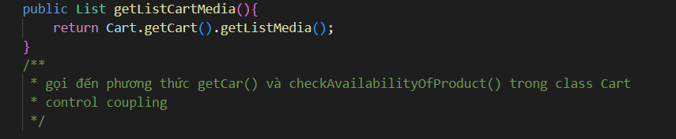
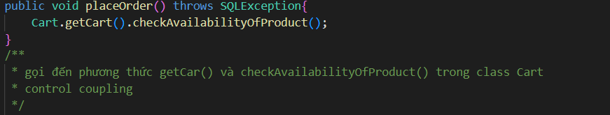
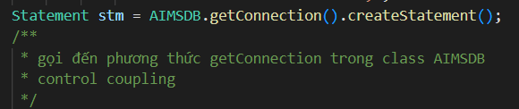
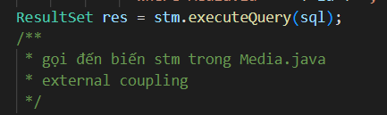
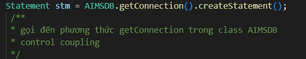

# TKXDPM.VN.20231-04

This is a Capstone's source code for Software Design and Construction project

## Team member

| Name           | Role        |
| :------------- | :---------- |
| Tạ Hữu Đăng    | Team Leader |
| Trịnh Quốc Đạt | Member      |
| Ngô Hoàng Hải Đăng  | Member      |
| Trần Văn Điền  | Member      |

## Report Content

  
W1: 27/11/2023~03/12/2023 

 

Tạ Hữu Đăng

 

- Assigned tasks:
  - Find content coupling
  - Find common coupling
  - ...

- Implementation details:
  - Pull Request(s): [https://github.com/dangtahuu/TKXDPM.KHMT.20231-04/pull/1]()
  - Specific implementation details: Find content and common coupling in the code base but didn't find anything

Trịnh Quốc Đạt

 

- Assigned tasks:
  - Find Control coupling: 

- Implementation details:
  - Pull Request(s): https://github.com/dangtahuu/TKXDPM.KHMT.20231-04/pull/2()
  - Specific implementation details:

    -Trong CartScreenHandler.java:
    
      - Phương thức **CartScreenHandle(...)** có thể được xác định mức độ coupling như sau:

        -**Control Coupling**: Gọi **homeScreenHandler.show()** khi hình ảnh aimsImage được click và gọi **requestToPlaceOrder()** khi nút **btnPlaceOrder** được click.

        -**Data Coupling**: Sử dụng dữ liệu từ **"assets/images/Logo.png"** để hiển thị hình ảnh. 

        -**Content Coupling**: Có mức độ coupling với nội dung của phương thức **homeScreenHandler.show()** và **requestToPlaceOrder()**.
      
      - Phương thức **getBController()** có thể được xác định mức độ coupling như sau:

        -**Data Coupling**: Ép kiểu kết quả của **super.getBController()** thành **ViewCartController**. 

        -**Content Coupling**: Có mức độ coupling với nội dung của lớp cơ sở (superclass) mà **getBController** kế thừa. 

      - Phương thức **requestToViewCart(...)** có thể được xác định mức độ coupling như sau:

        -**Control Coupling**: Gọi **setPreviousScreen(prevScreen)** để thiết lập giá trị cho **previousScreen**. 

        -**Data Coupling**: Gọi **setPreviousScreen(prevScreen)** để thiết lập giá trị cho **previousScreen**. 

        -**Content Coupling**: Có mức độ coupling với nội dung của phương thức **getBController().checkAvailabilityOfProduct()**. 

      - Phương thức **requestToPlaceOrder()** có thể được xác định mức độ coupling như sau:

        -**Control Coupling**: Gọi **placeOrderController.getListCartMedia().size()** để kiểm tra kích thước danh sách phương tiện trong giỏ hàng.

        -**Data Coupling**: Gọi **placeOrderController.getListCartMedia().size()** để kiểm tra kích thước danh sách phương tiện trong giỏ hàng.

        -**Content Coupling**: Có mức độ coupling với nội dung của các phương thức trong **PlaceOrderController** như **placeOrderController**.**getListCartMedia()**, **placeOrderController.placeOrder()**, và **placeOrderController.createOrder()**.

      - Phương thức **updateCart()** có thể được xác định mức độ coupling như sau:

        -**Control Coupling**: Gọi **getBController().checkAvailabilityOfProduct()** để kiểm tra sự có sẵn của sản phẩm. 

        -**Data Coupling**: Gọi **getBController().checkAvailabilityOfProduct()** để kiểm tra sự có sẵn của sản phẩm. Gọi **displayCartWithMediaAvailability()** để hiển thị giỏ hàng.

        -**Content Coupling**: Có mức độ coupling với nội dung của phương thức **getBController().checkAvailabilityOfProduct()**.

      - Phương thức **updateCartAmount()** có thể được xác định mức độ coupling như sau:

        -**Control Coupling**: Gọi **getBController().getCartSubtotal()** để lấy dữ liệu về tổng cộng giỏ hàng.

        -**Data Coupling**: Gọi **getBController().getCartSubtotal()** để lấy dữ liệu về tổng cộng giỏ hàng

        -**Content Coupling**: Có mức độ coupling với nội dung của phương thức **getBController().getCartSubtotal()**.

      - Phương thức **displayCartWithMediaAvailability()** có thể được xác định mức độ coupling như sau:

        -**Control Coupling**: Gọi **getBController().getListCartMedia()** để lấy danh sách phương tiện trong giỏ hàng sau khi kiểm tra sự có sẵn. 

        -**Data Coupling**: Gọi **getBController().getListCartMedia()** để lấy danh sách phương tiện trong giỏ hàng sau khi kiểm tra sự có sẵn.

        -**Content Coupling**: Có mức độ coupling với nội dung của lớp **MediaHandler**, đặc biệt là khi tạo một đối tượng **MediaHandler** và gọi các phương thức như **setCartMedia** và **getContent**.

    -Trong **MediaHandler.java**:

      - Phương thức **MediaHandler(...)** có thể được xác định mức độ coupling như sau:

        -**Data Coupling**: Gán giá trị của **cartScreen** bằng **cartScreen** được truyền vào. Nếu **cartScreen** là một đối tượng của một lớp cụ thể, có mức độ coupling dữ liệu.

        -**Content Coupling**: Gọi **super(screenPath)** để khởi tạo lớp cơ sở **(BaseScreenHandler)**.

      - Phương thức **setCartMedia(...)** có thể được xác định mức độ coupling như sau:

        -**Data Coupling**: Gán giá trị của **cartMedia** cho thuộc tính **cartMedia**.

        -**Content Coupling**: Gọi **setMediaInfo()** để thiết lập thông tin về phương tiện. Nếu phương thức này sử dụng hoặc ảnh hưởng đến nội dung của lớp **MediaHandler**, có mức độ coupling nội dung.

      - Phương thức **setMediaInfo()** có thể được xác định mức độ coupling như sau:

        -**Control Coupling**: Gọi **cartMedia.getMedia().getTitle()**, **cartMedia.getPrice()**, và **cartMedia.getMedia().getImageURL()** để lấy thông tin về phương tiện. Gọi **Cart.getCart().removeCartMedia(cartMedia)** để xóa phương tiện khỏi giỏ hàng.

        -**Data Coupling**: Gọi **cartMedia.getMedia().getTitle()** để lấy thông tin về tiêu đề phương tiện. Gọi **cartMedia.getPrice()** để lấy giá phương tiện. 

        -**Content Coupling**: Có mức độ coupling với các thành phần giao diện người dùng như title, price, image, và btnDelete.

      - Phương thức **initializeSpinner()** có thể được xác định mức độ coupling như sau:

        -**Control Coupling**: Gọi **cartMedia.getQuantity()** và **cartMedia.getMedia().getQuantity()** để lấy thông tin về số lượng phương tiện trong giỏ hàng và số lượng tồn kho. Gọi **cartMedia.setQuantity(numOfProd)** để cập nhật số lượng phương tiện trong giỏ hàng.

        -**Data Coupling**: Gọi **cartMedia.getQuantity()** để lấy thông tin về số lượng phương tiện trong giỏ hàng. Gọi **cartMedia.getMedia().getQuantity()** để lấy thông tin về số lượng tồn kho của phương tiện.

        -**Content Coupling**: Có mức độ coupling với các thành phần giao diện người dùng như spinnerFX, spinner, và labelOutOfStock.

    -Trong **HomeScreenHandler.java**:

      - Phương thức **HomeScreenHandler(...)** có thể được xác định mức độ coupling như sau:

        -**Control Coupling**: Gọi **super(stage, screenPath)** để gọi khởi tạo của lớp cơ sở **(BaseScreenHandler)**

      - Phương thức **show()** có thể được xác định mức độ coupling như sau:

        -**Control Coupling**: Gọi **Cart.getCart().getListMedia().size()** để lấy số lượng phương tiện trong giỏ hàng. Gọi **super.show()** để gọi phương thức show của lớp cơ sở **(BaseScreenHandler)**.

        -**Data Coupling**: Gọi **Cart.getCart().getListMedia().size()** để lấy số lượng phương tiện trong giỏ hàng. 

      - Phương thức **initialize(...)** có thể được xác định mức độ coupling như sau:

        -**Control Coupling**: Gọi **Cart.getCart().getListMedia().size()** để lấy số lượng phương tiện trong giỏ hàng. Gọi **super.show()** để gọi phương thức show của lớp cơ sở **(BaseScreenHandler)**.

        -**Data Coupling**: Gọi **Cart.getCart().getListMedia().size()** để lấy số lượng phương tiện trong giỏ hàng.

      - Phương thức **setImage()** có thể được xác định mức độ coupling như sau:

        -**Data Coupling**: Sử dụng **Configs.IMAGE_PATH** để xây dựng đường dẫn cho hình ảnh.

        -**Content Coupling**: Có mức độ coupling với các thành phần giao diện người dùng như **imsImage** và **cartImage**. 

      - Phương thức **addMediaHom(...)** có thể được xác định mức độ coupling như sau:

        -**Control Coupling**: Sử dụng items để tạo ra một bản sao của danh sách phương tiện. Sử dụng **hboxMedia.getChildren().forEach**, **vBox**.**getChildren().clear()**, **hboxMedia.getChildren().indexOf(node)**, và **vBox.getChildren().add(media.getContent())** để thực hiện các thao tác trên giao diện.
 
        -**Data Coupling**: Gọi **items.size()** để lấy số lượng phương tiện trong danh sách.

        -**Content Coupling**: Có mức độ coupling với các thành phần giao diện người dùng như **hboxMedia** và **VBox**.

      - Phương thức **addMenuItem(...)** có thể được xác định mức độ coupling như sau:

        -**Control Coupling**: Sử dụng menuButton.getItems().add(position, menuItem) để thêm một MenuItem vào menuButton.Sử dụng hboxMedia.getChildren().forEach, vBox.getChildren().clear(), và addMediaHome(filteredItems) để thực hiện các thao tác trên giao diện. 

        -**Data Coupling**: Sử dụng text, menuButton, menuButton.widthProperty(), và homeItems để tạo và cấu hình menu item.

        -**Content Coupling**: Có mức độ coupling với các thành phần giao diện người dùng như menuButton. 

    -Trong **MediaHandle.java**:

      - Phương thức **CartScreenHandle(...)** có thể được xác định mức độ coupling như sau:

        -**Control Coupling**: Sử dụng addToCartBtn.setOnMouseClicked để thiết lập sự kiện khi click vào nút "Add to Cart".

        -**Data Coupling**: Sử dụng screenPath, media, home, addToCartBtn, spinnerChangeNumber, media.getQuantity(), home.getBController(), media.getTitle(), media.getPrice(), home.getNumMediaCartLabel(), để tạo và cấu hình MediaHandler.

      - Phương thức **setMediaInfo()** có thể được xác định mức độ coupling như sau:

        -**Data Coupling**: Sử dụng media, media.getImageURL(), media.getTitle(), media.getPrice(), và media.getQuantity() để thiết lập thông tin của phương tiện.

        -**Content Coupling**: Sử dụng mediaImage, mediaTitle, mediaPrice, mediaAvail, và spinnerChangeNumber để thiết lập nội dung giao diện người dùng.

Trần Văn Điền

 

- Assigned tasks:
  - Find coupling trong paymentController, entity.media

- Implementation details:
  - Pull Request(s): 
  - Specific implementation details:
  1. PaymentController:
      Common Coupling :
        Class PaymentController có sử dụng các ngoại lệ như InvalidCardException, PaymentException, và UnrecognizedException từ package common.exception.

      Content Coupling :
        Phương thức getExpirationDate truy cập và xử lý nội dung của biến date.

      Control Coupling :
        Class PaymentController tương tác với InterbankSubsystem để thực hiện thanh toán thông qua gọi phương thức payOrder.

      Stamp Coupling :
        Class PaymentController sử dụng dữ liệu từ CreditCard và PaymentTransaction để thực hiện và xác nhận thanh toán.

      Data Coupling :
        Phương thức payOrder nhận dữ liệu từ các tham số như amount, contents, cardNumber, cardHolderName, expirationDate, và securityCode để thực hiện thanh toán.
  2. entity.media
      Common Coupling :
        Class Media có sử dụng Logger từ package java.util.logging để ghi log.

      Content Coupling:
        Các phương thức của class Media truy cập và thao tác nội dung của các trường như id, title, category, price, quantity, type, và imageURL.

      Control Coupling :
        Class Media tương tác với cơ sở dữ liệu thông qua các phương thức như getMediaById, getAllMedia, và updateMediaFieldById. Các phương thức này thực hiện kiểm soát cơ sở dữ liệu để truy vấn, cập nhật và lấy dữ liệu về đối tượng Media.

      Stamp Coupling :
        Class Media sử dụng AIMSDB để kết nối và thực hiện các thao tác cơ sở dữ liệu, cũng như sử dụng Utils để có được một đối tượng Logger.

      Data Coupling :
        Phương thức updateMediaFieldById nhận dữ liệu từ các tham số như tbname, id, field, và value để cập nhật dữ liệu trong cơ sở dữ liệu.

Ngô Hoàng Hải Đăng

 

- Assigned tasks:
  - Tìm control coupling trong file src

- Implementation details:
  - Pull Request(s): [Attach links to your pull requests here. You can attach multiple pull requests]()
  - Specific implementation details:
    
    
    
    
    

  
W2: 03/12/2023~10/12/2023 

 

Tạ Hữu Đăng

 
- Assigned tasks:
  - Find Cohesion trong InvoiceScreenHandler.java, MediaInvoiceScreenHandler.java, PaymentScreenHandler.java, ResultScreenHandler.java : 
- Implementation details:
  
  - Pull Request(s): [https://github.com/dangtahuu/TKXDPM.KHMT.20231-04/pull/6]()
    
  - Specific implementation details: 
  
  1. Trong InvoiceScreenHandler.java
      - Functional Cohesion: setInvoiceInfo() thực hiện các thao tác liên quan đến việc thiết lập thông tin hóa đơn. Các phương thức khác thường liên quan đến việc hiển thị hóa đơn và xác nhận thanh toán.
      - Communicational Cohesion: Có sự chia sẻ dữ liệu giữa InvoiceScreenHandler và đối tượng Invoice, cũng như giữa Invoice và Order.
      - Procedural Cohesion: Phần xử lý sự kiện confirmInvoice liên quan đến xác nhận thanh toán và hiển thị màn hình thanh toán.
      - Sequential Cohesion: Các dòng mã trong setInvoiceInfo() thực hiện các thao tác theo một thứ tự cụ thể để hiển thị thông tin hóa đơn.
  
  2. Trong MediaInvoiceScreenHandler.java
      - Functional Cohesion: Lớp này chủ yếu thực hiện các chức năng liên quan đến hiển thị thông tin về đối tượng OrderMedia trên màn hình hoá đơn.

      - Sequential Cohesion: Phương thức setMediaInfo() thực hiện các bước liên tiếp để thiết lập thông tin hình ảnh, tiêu đề, giá cả và số lượng sản phẩm.

      - Communicational Cohesion: Có sự chia sẻ dữ liệu giữa lớp MediaInvoiceScreenHandler và đối tượng OrderMedia để hiển thị thông tin chi tiết về sản phẩm trên hoá đơn.

      - Procedural Cohesion: Tất cả các phương thức của lớp này đều liên quan đến việc hiển thị thông tin và hình ảnh về đối tượng OrderMedia.

  3. Trong PaymentScreenHandler.java

        - Functional Cohesion: Lớp này chủ yếu thực hiện các chức năng liên quan đến thanh toán, bao gồm cả việc hiển thị giao diện người dùng và xử lý thanh toán thực tế thông qua PaymentController.

        - Sequential Cohesion: Các phương thức trong lớp được gọi theo một thứ tự nhất định để thực hiện quy trình thanh toán. Ví dụ, confirmToPayOrder gọi payOrder và sau đó tạo và hiển thị màn hình kết quả.

        - Communicational Cohesion: Các thành viên của lớp tương tác chủ yếu để thực hiện chức năng thanh toán và hiển thị kết quả.

  4. Trong ResultScreenHandler.java

        - Functional Cohesion: Các phương thức trong class ResultScreenHandler liên quan chặt chẽ đến việc xử lý và hiển thị kết quả màn hình.

        - Sequential Cohesion: Các phương thức và trình tự thực hiện các bước liên tục để xác nhận thanh toán và hiển thị kết quả.

        - Communicational Cohesion: Các thành phần UI (resultLabel, messageLabel, okButton) được cập nhật và tương tác chủ yếu qua các dữ liệu như result và message.

        - Temporal Cohesion: Các phương thức thường xuyên được gọi cùng nhau trong một chuỗi thời gian khi người dùng xác nhận thanh toán (confirmPayment gọi homeScreenHandler.show()).

Trịnh Quốc Đạt

 

- Assigned tasks:
  - Find Cohesion trong CartScreenHandler.java, cart.MediaHandler.java, HomeScreenHandler.java, home.MediaHandler.java : 

- Implementation details:
  - Pull Request(s): https://github.com/dangtahuu/TKXDPM.KHMT.20231-04/pull/5()
  - Specific implementation details: 

      1,Trong **cart.CartScreenHandler.java**:
    
      - Phương thức **CartScreenHandle(...)** có thể được xác định Cohesion như sau:

        -**Logical Cohesion**: Phương thức khởi tạo chủ yếu tập trung vào thiết lập các thành phần đồ họa (UI), đặc biệt là hình ảnh logo và xử lý sự kiện khi nút được nhấn. Điều này làm tăng mức độ logical cohesion vì nó liên quan chặt chẽ đến việc khởi tạo màn hình và xử lý các sự kiện liên quan.

        -**Functional Cohesion**: Các hành động trong phương thức chủ yếu liên quan đến việc cấu hình UI và xử lý sự kiện khi nhấn nút.

        -**Sequential Cohesion**: Các bước thực hiện theo một dãy sự kiện liên quan đến khởi tạo màn hình và xử lý sự kiện.

      - Phương thức **requestToViewCart(...)** có thể được xác định Cohesion như sau:

        -**Logical Cohesion**: Chịu trách nhiệm hiển thị giỏ hàng và xử lý việc kiểm tra sự có sẵn của sản phẩm trong giỏ hàng. Điều này tăng mức độ logical cohesion vì nó liên quan chặt chẽ đến việc hiển thị giỏ hàng và xử lý các kiểm tra.

        -**Functional Cohesion**: Các hành động trong phương thức chủ yếu liên quan đến việc hiển thị giỏ hàng và kiểm tra sự có sẵn của sản phẩm.

      - Phương thức **requestToPlaceOrder(...)** có thể được xác định Cohesion như sau:

        -**Logical Cohesion**: Phương thức chịu trách nhiệm cho quy trình đặt hàng, kiểm tra có sẵn của sản phẩm và hiển thị màn hình vận chuyển. Điều này tăng mức độ logical cohesion vì nó liên quan chặt chẽ đến quy trình đặt hàng.

        -**Functional Cohesion**: Các hành động trong phương thức chủ yếu liên quan đến việc hiển thị giỏ hàng và kiểm tra sự có sẵn của sản phẩm.

      - Phương thức **requestToPlaceOrder(...)** có thể được xác định Cohesion như sau:

        -**Logical Cohesion**: Phương thức chịu trách nhiệm cho quy trình đặt hàng, kiểm tra có sẵn của sản phẩm và hiển thị màn hình vận chuyển. Điều này tăng mức độ logical cohesion vì nó liên quan chặt chẽ đến quy trình đặt hàng.

        -**Functional Cohesion**: Các hành động trong phương thức chủ yếu liên quan đến quy trình đặt hàng và hiển thị màn hình vận chuyển.

      - Phương thức **updateCart(...)** có thể được xác định Cohesion như sau:

        -**Logical Cohesion**: Chịu trách nhiệm kiểm tra lại sự có sẵn của sản phẩm trong giỏ hàng và hiển thị lại giỏ hàng. Điều này tăng mức độ logical cohesion vì nó liên quan chặt chẽ đến việc kiểm tra và hiển thị giỏ hàng.

        -**Functional Cohesion**: Các hành động trong phương thức chủ yếu liên quan đến việc kiểm tra và hiển thị giỏ hàng.

      - Phương thức **updateCartAmount(...)** có thể được xác định Cohesion như sau:

        -**Logical Cohesion**: Chịu trách nhiệm tính toán và cập nhật các số liệu về giỏ hàng như tổng giá trị, thuế VAT, và tổng cộng. Điều này tăng mức độ logical cohesion vì nó liên quan chặt chẽ đến cập nhật các số liệu giỏ hàng.

        -**Functional Cohesion**: Các hành động trong phương thức chủ yếu liên quan đến việc tính toán và cập nhật các số liệu giỏ hàng.

      - Phương thức **displayCartWithMediaAvailability(...)** có thể được xác định Cohesion như sau:

        -**Logical Cohesion**: Chịu trách nhiệm hiển thị danh sách sản phẩm trong giỏ hàng và cập nhật số liệu liên quan. Điều này tăng mức độ logical cohesion vì nó liên quan chặt chẽ đến việc hiển thị giỏ hàng và cập nhật số liệu.

        -**Functional Cohesion**: Các hành động trong phương thức chủ yếu liên quan đến việc hiển thị giỏ hàng và cập nhật số liệu.

    2, Trong **cart.MediaHandler.java**:

      - Phương thức **MediaHandler(...)** có thể được xác định Cohesion như sau:

        -**Logical Cohesion**: Phương thức khởi tạo chủ yếu tập trung vào thiết lập các thành phần đồ họa (UI) của một phần tử truyền thông trên màn hình giỏ hàng. Điều này tăng mức độ logical cohesion vì nó liên quan chặt chẽ đến việc khởi tạo và hiển thị một phần tử truyền thông trong giỏ hàng.

        -**Functional Cohesion**: Các hành động trong phương thức chủ yếu liên quan đến việc cấu hình UI và khởi tạo các thành phần.

      - Phương thức **CartScreenHandle(...)** có thể được xác định Cohesion như sau:

        -**Logical Cohesion**: 

        -**Functional Cohesion**: 

        -**Sequential Cohesion**: 

      - Phương thức **setCartMedia(...)** có thể được xác định Cohesion như sau:

        -**Logical Cohesion**: Chịu trách nhiệm gán một CartMedia cụ thể cho MediaHandler và gọi setMediaInfo để hiển thị thông tin của nó. Điều này tăng mức độ logical cohesion vì nó liên quan chặt chẽ đến việc gán và hiển thị thông tin của CartMedia.

        -**Functional Cohesion**: Các hành động trong phương thức chủ yếu liên quan đến việc gán CartMedia và hiển thị thông tin của nó.

      - Phương thức **setMediaInfo(...)** có thể được xác định Cohesion như sau:

        -**Logical Cohesion**: Chịu trách nhiệm thiết lập thông tin cơ bản của CartMedia như tiêu đề, giá, và hình ảnh, sau đó gọi initializeSpinner để cấu hình spinner và nút xóa. Điều này tăng mức độ logical cohesion vì nó liên quan chặt chẽ đến việc hiển thị thông tin và cấu hình các thành phần khác.

        -**Functional Cohesion**: Các hành động trong phương thức chủ yếu liên quan đến việc thiết lập thông tin và cấu hình spinner.

      - Phương thức **initializeSpinner(...)** có thể được xác định Cohesion như sau:

        -**Logical Cohesion**: Chịu trách nhiệm khởi tạo và cấu hình Spinner để cho phép người dùng chọn số lượng sản phẩm. Điều này tăng mức độ logical cohesion vì nó liên quan chặt chẽ đến việc khởi tạo và cấu hình spinner.

        -**Functional Cohesion**: Các hành động trong phương thức chủ yếu liên quan đến việc khởi tạo và cấu hình spinner.

    3,Trong **home.HomeScreenHandler.java**:

      - Phương thức **HomeScreenHandler(...)** có thể được xác định Cohesion như sau:

        -**Logical Cohesion**: Phương thức khởi tạo chủ yếu tập trung vào việc thiết lập các thành phần giao diện và khởi tạo dữ liệu ban đầu. Điều này tăng mức độ logical cohesion vì nó liên quan chặt chẽ đến quá trình khởi tạo màn hình chính của ứng dụng.

        -**Functional Cohesion**: Các hành động trong phương thức chủ yếu liên quan đến việc cấu hình UI và khởi tạo dữ liệu.

      - Phương thức **getNumMediaCartLabel(...)** có thể được xác định Cohesion như sau:

        -**Logical Cohesion**: Chịu trách nhiệm trả về nhãn hiển thị số lượng sản phẩm trong giỏ hàng. Điều này tăng mức độ logical cohesion vì nó liên quan chặt chẽ đến việc hiển thị thông tin về giỏ hàng.

        -**Functional Cohesion**: Các hành động trong phương thức chủ yếu liên quan đến việc trả về một thành phần giao diện cụ thể.

      - Phương thức **getBController(...)** có thể được xác định Cohesion như sau:

        -**Logical Cohesion**: Trả về đối tượng HomeController được gán cho BaseController của HomeScreenHandler. Điều này tăng mức độ logical cohesion vì nó liên quan chặt chẽ đến việc nhận HomeController.

        -**Functional Cohesion**: Các hành động trong phương thức chủ yếu liên quan đến việc trả về một đối tượng HomeController.

      - Phương thức **show(...)** có thể được xác định Cohesion như sau:

        -**Logical Cohesion**: Chịu trách nhiệm hiển thị màn hình chính và cập nhật số lượng sản phẩm trong giỏ hàng. Điều này tăng mức độ logical cohesion vì nó liên quan chặt chẽ đến việc hiển thị thông tin và cập nhật giỏ hàng.

        -**Functional Cohesion**: Các hành động trong phương thức chủ yếu liên quan đến việc hiển thị màn hình và cập nhật giỏ hàng.

      - Phương thức **initializeSpinner(...)** có thể được xác định Cohesion như sau:

        -**Logical Cohesion**: 

        -**Functional Cohesion**: 

        -**Sequential Cohesion**: 

      - Phương thức **initialize(...)** có thể được xác định Cohesion như sau:

        -**Logical Cohesion**: Phương thức initialize chịu trách nhiệm khởi tạo màn hình, tải danh sách phương tiện, và cấu hình sự kiện cho các phần tử giao diện. Điều này tăng mức độ logical cohesion vì nó liên quan chặt chẽ đến việc khởi tạo màn hình và xử lý sự kiện.

        -**Functional Cohesion**: Các hành động trong phương thức chủ yếu liên quan đến việc khởi tạo màn hình và xử lý sự kiện.

      - Phương thức **setImage(...)** có thể được xác định Cohesion như sau:

        -**Logical Cohesion**: 

        -**Functional Cohesion**: 

        -**Sequential Cohesion**: 

      - Phương thức **initializeSpinner(...)** có thể được xác định Cohesion như sau:

        -**Logical Cohesion**: Chịu trách nhiệm cập nhật hình ảnh cho ImageView được sử dụng trong màn hình. Điều này tăng mức độ logical cohesion vì nó liên quan chặt chẽ đến việc cập nhật hình ảnh.

        -**Functional Cohesion**: Các hành động trong phương thức chủ yếu liên quan đến việc cập nhật hình ảnh.

      - Phương thức **addMediaHome(...)** có thể được xác định Cohesion như sau:

        -**Logical Cohesion**: Chịu trách nhiệm thêm các mục phương tiện vào màn hình chính. Điều này tăng mức độ logical cohesion vì nó liên quan chặt chẽ đến việc thêm mục phương tiện vào màn hình.

        -**Functional Cohesion**: Các hành động trong phương thức chủ yếu liên quan đến việc thêm mục phương tiện vào màn hình.

      - Phương thức **addMenuItem(...)** có thể được xác định Cohesion như sau:

        -**Logical Cohesion**: Chịu trách nhiệm thêm các mục menu vào SplitMenuButton để lọc các phương tiện. Điều này tăng mức độ logical cohesion vì nó liên quan chặt chẽ đến việc thêm mục menu và lọc danh sách phương tiện.

        -**Functional Cohesion**: Các hành động trong phương thức chủ yếu liên quan đến việc thêm mục menu và lọc danh sách phương tiện.

    4,Trong **home.MediaHandle.java**:
        
      - Phương thức **MediaHandler(...)** có thể được xác định Cohesion như sau:

        -**Logical Cohesion**: Phương thức khởi tạo chủ yếu tập trung vào việc thiết lập các thành phần giao diện, khởi tạo dữ liệu, và xử lý sự kiện khi người dùng thêm phương tiện vào giỏ hàng. Điều này tăng mức độ logical cohesion vì nó liên quan chặt chẽ đến việc hiển thị thông tin phương tiện và xử lý thêm vào giỏ hàng.

        -**Functional Cohesion**: Các hành động trong phương thức chủ yếu liên quan đến việc khởi tạo giao diện và xử lý sự kiện.

      - Phương thức **getMedia(...)** có thể được xác định Cohesion như sau:

        -**Logical Cohesion**: Trả về đối tượng phương tiện liên quan đến MediaHandler. Điều này tăng mức độ logical cohesion vì nó liên quan chặt chẽ đến việc nhận đối tượng phương tiện.

        -**Functional Cohesion**: Các hành động trong phương thức chủ yếu liên quan đến việc trả về đối tượng phương tiện.

      - Phương thức **setMediaInfo(...)** có thể được xác định Cohesion như sau:

        -**Logical Cohesion**: Phương thức chịu trách nhiệm cập nhật thông tin về phương tiện trên giao diện người dùng. Điều này tăng mức độ logical cohesion vì nó liên quan chặt chẽ đến việc cập nhật giao diện và hiển thị thông tin phương tiện.

        -**Functional Cohesion**: Các hành động trong phương thức chủ yếu liên quan đến việc cập nhật thông tin và hiển thị giao diện.

      - Phương thức **addToCartBtn(...)** có thể được xác định Cohesion như sau:

        -**Logical Cohesion**: Sự kiện chịu trách nhiệm xử lý thêm phương tiện vào giỏ hàng khi người dùng nhấp vào nút "Thêm vào giỏ hàng". Điều này tăng mức độ logical cohesion vì nó liên quan chặt chẽ đến việc xử lý thêm vào giỏ hàng.

        -**Functional Cohesion**: Các hành động trong sự kiện chủ yếu liên quan đến việc kiểm tra và thêm phương tiện vào giỏ hàng.

      

Trần Văn Điền

 

- Assigned tasks:
  - Find coupling trong views.screen.payment, entity.payment, paymentController

- Implementation details:
  - Pull Request(s): 
  - Specific implementation details:
  1. PaymentController:
      Functional Cohesion:
        Các phương thức trong class tập trung vào chức năng cụ thể như getExpirationDate để xác thực và định dạng ngày hết hạn thẻ, và payOrder để thực hiện thanh toán.

      Sequential Cohesion:
        Các phương thức thường được gọi theo một thứ tự nhất định để thực hiện quy trình thanh toán, từ việc xác thực thông tin thẻ đến gọi dịch vụ thanh toán.

      Communicational Cohesion :
        Các thành viên của class tương tác để thực hiện một số chức năng cụ thể, như việc gửi thông tin thanh toán đến subsystem InterbankSubsystem.
  2. entity.media
      Functional Cohesion :
        Các phương thức trong class thường tập trung vào một chức năng cụ thể như lấy dữ liệu từ cơ sở dữ liệu (getMediaById, getAllMedia), cập nhật dữ liệu trong cơ sở dữ liệu (updateMediaFieldById), và các phương thức getter và setter.

      Sequential Cohesion:
        Các phương thức thường được gọi theo một thứ tự nhất định để thực hiện các bước của quy trình, chẳng hạn như lấy dữ liệu từ cơ sở dữ liệu, xử lý dữ liệu và cập nhật dữ liệu.

      Communicational Cohesion :
        Các thành viên của class tương tác để thực hiện một số chức năng cụ thể, như trao đổi thông tin với cơ sở dữ liệu và thao tác với dữ liệu đối tượng Media.

      Procedural Cohesion :
        Các phương thức trong class thường thực hiện các bước liên tiếp để đạt được một mục tiêu chức năng nhất định.

      Temporal Cohesion :
        Các phương thức được gọi cùng một lúc để thực hiện một số chức năng trong khoảng thời gian ngắn, như khi lấy dữ liệu từ cơ sở dữ liệu và cập nhật thông tin trạng thái.

Ngô Hoàng Hải Đăng

 

- Assigned tasks:
  - Find cohesion và coupling trong views/screen/shippingpayment, views/screen/invoice

---
