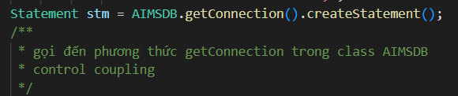
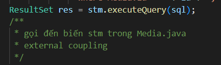
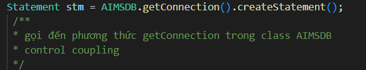

# TKXDPM.VN.20231-01

This is a Capstone's source code for Software Design and Construction project

## Team member

| Name           | Role        |
| :------------- | :---------- |
| Tạ Hữu Đăng    | Team Leader |
| Trịnh Quốc Đạt | Member      |
| Ngô Hoàng Hải Đăng  | Member      |
| Trần Văn Điền  | Member      |

## Report Content

  
27/11/2023~03/12/2023 

 

Trịnh Quốc Đạt

 

- Assigned tasks:
  - Chỉ ra các loại coupling cho các hàm trong CartScreenHandler.java, MediaHandler.java, HomeScreenHandler.java, MediaHandler.java

- Implementation details:
  - Pull Request(s): https://github.com/dangtahuu/TKXDPM.KHMT.20231-04/pull/2()
  - Specific implementation details:

    -Trong CartScreenHandler.java:
    
      - Phương thức **CartScreenHandle(...)** có thể được xác định mức độ coupling như sau:

        -**Control Coupling**: Gọi **homeScreenHandler.show()** khi hình ảnh aimsImage được click và gọi **requestToPlaceOrder()** khi nút **btnPlaceOrder** được click.

        -**Data Coupling**: Sử dụng dữ liệu từ **"assets/images/Logo.png"** để hiển thị hình ảnh. 

        -**Content Coupling**: Có mức độ coupling với nội dung của phương thức **homeScreenHandler.show()** và **requestToPlaceOrder()**.
      
      - Phương thức **getBController()** có thể được xác định mức độ coupling như sau:

        -**Data Coupling**: Ép kiểu kết quả của **super.getBController()** thành **ViewCartController**. 

        -**Content Coupling**: Có mức độ coupling với nội dung của lớp cơ sở (superclass) mà **getBController** kế thừa. 

      - Phương thức **requestToViewCart(...)** có thể được xác định mức độ coupling như sau:

        -**Control Coupling**: Gọi **setPreviousScreen(prevScreen)** để thiết lập giá trị cho **previousScreen**. 

        -**Data Coupling**: Gọi **setPreviousScreen(prevScreen)** để thiết lập giá trị cho **previousScreen**. 

        -**Content Coupling**: Có mức độ coupling với nội dung của phương thức **getBController().checkAvailabilityOfProduct()**. 

      - Phương thức **requestToPlaceOrder()** có thể được xác định mức độ coupling như sau:

        -**Control Coupling**: Gọi **placeOrderController.getListCartMedia().size()** để kiểm tra kích thước danh sách phương tiện trong giỏ hàng.

        -**Data Coupling**: Gọi **placeOrderController.getListCartMedia().size()** để kiểm tra kích thước danh sách phương tiện trong giỏ hàng.

        -**Content Coupling**: Có mức độ coupling với nội dung của các phương thức trong **PlaceOrderController** như **placeOrderController**.**getListCartMedia()**, **placeOrderController.placeOrder()**, và **placeOrderController.createOrder()**.

      - Phương thức **updateCart()** có thể được xác định mức độ coupling như sau:

        -**Control Coupling**: Gọi **getBController().checkAvailabilityOfProduct()** để kiểm tra sự có sẵn của sản phẩm. 

        -**Data Coupling**: Gọi **getBController().checkAvailabilityOfProduct()** để kiểm tra sự có sẵn của sản phẩm. Gọi **displayCartWithMediaAvailability()** để hiển thị giỏ hàng.

        -**Content Coupling**: Có mức độ coupling với nội dung của phương thức **getBController().checkAvailabilityOfProduct()**.

      - Phương thức **updateCartAmount()** có thể được xác định mức độ coupling như sau:

        -**Control Coupling**: Gọi **getBController().getCartSubtotal()** để lấy dữ liệu về tổng cộng giỏ hàng.

        -**Data Coupling**: Gọi **getBController().getCartSubtotal()** để lấy dữ liệu về tổng cộng giỏ hàng

        -**Content Coupling**: Có mức độ coupling với nội dung của phương thức **getBController().getCartSubtotal()**.

      - Phương thức **displayCartWithMediaAvailability()** có thể được xác định mức độ coupling như sau:

        -**Control Coupling**: Gọi **getBController().getListCartMedia()** để lấy danh sách phương tiện trong giỏ hàng sau khi kiểm tra sự có sẵn. 

        -**Data Coupling**: Gọi **getBController().getListCartMedia()** để lấy danh sách phương tiện trong giỏ hàng sau khi kiểm tra sự có sẵn.

        -**Content Coupling**: Có mức độ coupling với nội dung của lớp **MediaHandler**, đặc biệt là khi tạo một đối tượng **MediaHandler** và gọi các phương thức như **setCartMedia** và **getContent**.

    -Trong **MediaHandler.java**:

      - Phương thức **MediaHandler(...)** có thể được xác định mức độ coupling như sau:

        -**Data Coupling**: Gán giá trị của **cartScreen** bằng **cartScreen** được truyền vào. Nếu **cartScreen** là một đối tượng của một lớp cụ thể, có mức độ coupling dữ liệu.

        -**Content Coupling**: Gọi **super(screenPath)** để khởi tạo lớp cơ sở **(BaseScreenHandler)**.

      - Phương thức **setCartMedia(...)** có thể được xác định mức độ coupling như sau:

        -**Data Coupling**: Gán giá trị của **cartMedia** cho thuộc tính **cartMedia**.

        -**Content Coupling**: Gọi **setMediaInfo()** để thiết lập thông tin về phương tiện. Nếu phương thức này sử dụng hoặc ảnh hưởng đến nội dung của lớp **MediaHandler**, có mức độ coupling nội dung.

      - Phương thức **setMediaInfo()** có thể được xác định mức độ coupling như sau:

        -**Control Coupling**: Gọi **cartMedia.getMedia().getTitle()**, **cartMedia.getPrice()**, và **cartMedia.getMedia().getImageURL()** để lấy thông tin về phương tiện. Gọi **Cart.getCart().removeCartMedia(cartMedia)** để xóa phương tiện khỏi giỏ hàng.

        -**Data Coupling**: Gọi **cartMedia.getMedia().getTitle()** để lấy thông tin về tiêu đề phương tiện. Gọi **cartMedia.getPrice()** để lấy giá phương tiện. 

        -**Content Coupling**: Có mức độ coupling với các thành phần giao diện người dùng như title, price, image, và btnDelete.

      - Phương thức **initializeSpinner()** có thể được xác định mức độ coupling như sau:

        -**Control Coupling**: Gọi **cartMedia.getQuantity()** và **cartMedia.getMedia().getQuantity()** để lấy thông tin về số lượng phương tiện trong giỏ hàng và số lượng tồn kho. Gọi **cartMedia.setQuantity(numOfProd)** để cập nhật số lượng phương tiện trong giỏ hàng.

        -**Data Coupling**: Gọi **cartMedia.getQuantity()** để lấy thông tin về số lượng phương tiện trong giỏ hàng. Gọi **cartMedia.getMedia().getQuantity()** để lấy thông tin về số lượng tồn kho của phương tiện.

        -**Content Coupling**: Có mức độ coupling với các thành phần giao diện người dùng như spinnerFX, spinner, và labelOutOfStock.

    -Trong **HomeScreenHandler.java**:

      - Phương thức **HomeScreenHandler(...)** có thể được xác định mức độ coupling như sau:

        -**Control Coupling**: Gọi **super(stage, screenPath)** để gọi khởi tạo của lớp cơ sở **(BaseScreenHandler)**

      - Phương thức **show()** có thể được xác định mức độ coupling như sau:

        -**Control Coupling**: Gọi **Cart.getCart().getListMedia().size()** để lấy số lượng phương tiện trong giỏ hàng. Gọi **super.show()** để gọi phương thức show của lớp cơ sở **(BaseScreenHandler)**.

        -**Data Coupling**: Gọi **Cart.getCart().getListMedia().size()** để lấy số lượng phương tiện trong giỏ hàng. 

      - Phương thức **initialize(...)** có thể được xác định mức độ coupling như sau:

        -**Control Coupling**: Gọi **Cart.getCart().getListMedia().size()** để lấy số lượng phương tiện trong giỏ hàng. Gọi **super.show()** để gọi phương thức show của lớp cơ sở **(BaseScreenHandler)**.

        -**Data Coupling**: Gọi **Cart.getCart().getListMedia().size()** để lấy số lượng phương tiện trong giỏ hàng.

      - Phương thức **setImage()** có thể được xác định mức độ coupling như sau:

        -**Data Coupling**: Sử dụng **Configs.IMAGE_PATH** để xây dựng đường dẫn cho hình ảnh.

        -**Content Coupling**: Có mức độ coupling với các thành phần giao diện người dùng như **imsImage** và **cartImage**. 

      - Phương thức **addMediaHom(...)** có thể được xác định mức độ coupling như sau:

        -**Control Coupling**: Sử dụng items để tạo ra một bản sao của danh sách phương tiện. Sử dụng **hboxMedia.getChildren().forEach**, **vBox**.**getChildren().clear()**, **hboxMedia.getChildren().indexOf(node)**, và **vBox.getChildren().add(media.getContent())** để thực hiện các thao tác trên giao diện.
 
        -**Data Coupling**: Gọi **items.size()** để lấy số lượng phương tiện trong danh sách.

        -**Content Coupling**: Có mức độ coupling với các thành phần giao diện người dùng như **hboxMedia** và **VBox**.

      - Phương thức **addMenuItem(...)** có thể được xác định mức độ coupling như sau:

        -**Control Coupling**: Sử dụng menuButton.getItems().add(position, menuItem) để thêm một MenuItem vào menuButton.Sử dụng hboxMedia.getChildren().forEach, vBox.getChildren().clear(), và addMediaHome(filteredItems) để thực hiện các thao tác trên giao diện. 

        -**Data Coupling**: Sử dụng text, menuButton, menuButton.widthProperty(), và homeItems để tạo và cấu hình menu item.

        -**Content Coupling**: Có mức độ coupling với các thành phần giao diện người dùng như menuButton. 

    -Trong **MediaHandle.java**:

      - Phương thức **CartScreenHandle(...)** có thể được xác định mức độ coupling như sau:

        -**Control Coupling**: Sử dụng addToCartBtn.setOnMouseClicked để thiết lập sự kiện khi click vào nút "Add to Cart".

        -**Data Coupling**: Sử dụng screenPath, media, home, addToCartBtn, spinnerChangeNumber, media.getQuantity(), home.getBController(), media.getTitle(), media.getPrice(), home.getNumMediaCartLabel(), để tạo và cấu hình MediaHandler.

      - Phương thức **setMediaInfo()** có thể được xác định mức độ coupling như sau:

        -**Data Coupling**: Sử dụng media, media.getImageURL(), media.getTitle(), media.getPrice(), và media.getQuantity() để thiết lập thông tin của phương tiện.

        -**Content Coupling**: Sử dụng mediaImage, mediaTitle, mediaPrice, mediaAvail, và spinnerChangeNumber để thiết lập nội dung giao diện người dùng.

Ngô Hoàng Hải Đăng

 

- Assigned tasks:
  - Tìm control coupling trong file src

- Implementation details:
  - Pull Request(s): [Attach links to your pull requests here. You can attach multiple pull requests]()
  - Specific implementation details:
    
    
    
    
    

---

  
W2: 03/12/2023~10/12/2023 

 

Ngô Hoàng Hải Đăng

 

- Tìm các coupling trong folder views/shipping và views/invoice, file controlller/PlaceOrderController.java

- Implementation details:
  - Đã thêm comment coupling và giải thích vào các folder và file nói ở trên

Team Member 2

 

- Assigned tasks:
  - Task 1
  - Task 2
  - ...

- Implementation details:
  - Pull Request(s): [Attach links to your pull requests here. You can attach multiple pull requests]()
  - Specific implementation details:
    - Describe specific in detail what you did last week
    - You can attach images if you want

---

  
W5: 01/10/2023~08/10/2023 

 

Team Member 1

 

- Assigned tasks:
  - Task 1
  - Task 2
  - ...

- Implementation details:
  - Pull Request(s): [Attach links to your pull requests here. You can attach multiple pull requests]()
  - Specific implementation details:
    - Describe specific in detail what you did last week
    - You can attach images if you want

Team Member 2

 

- Assigned tasks:
  - Task 1
  - Task 2
  - ...

- Implementation details:
  - Pull Request(s): [Attach links to your pull requests here. You can attach multiple pull requests]()
  - Specific implementation details:
    - Describe specific in detail what you did last week
    - You can attach images if you want

---
